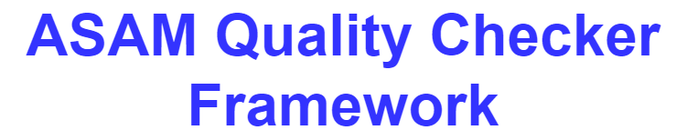

<!---
Copyright 2023 CARIAD SE.

This Source Code Form is subject to the terms of the Mozilla
Public License, v. 2.0. If a copy of the MPL was not distributed
with this file, You can obtain one at https://mozilla.org/MPL/2.0/.
-->

# 

**Disclaimer**: The current version is a release candidate. The first official release is expected to be in November.

The ASAM Quality Checker Framework is designed for quality assessment of the
ASAM standards like
[OpenDRIVE](https://www.asam.net/standards/detail/opendrive),
[OpenSCENARIO XML](https://www.asam.net/standards/detail/openscenario-xml/) and others.
This quality assessment is done by so called checkers that are grouped into
checker libraries.

The framework can easily be extended with additional checker libraries
and users are able to select which checks will be included in their
configuration. Checkers are implemented in checker bundles. These are
executables, so it is possible to write checker bundles in any programming
language.

All individual checker outputs are collected and merged into a single result
file, that can be evaluated either automatically by parsing the XML output,
manually by reading the text output or interactively using the provided
"ReportGUI" module.

# Use Cases

The ASAM Quality Checker Framework allows developers to write their own rule
sets that go beyond the verification of the formal correctness by means of the
XML Schema files. The formal correctness is only a first step and not
sufficient to assess the quality. Hence more sophisticated quality checks are
required.

The framework was designed to support a variety of use cases that require
different types of checkers. Most applications require checkers that evaluate
geometries, other physical properties or the data integrity of the static and
dynamic parts of a virtual environment.

Other checkers may be created for statistical evaluation of the input files.
This allows users to ensure the existence of specific objects, such as
obstacles or traffic signs that are crucial for their use-case in the input
files.

Additionally, there may be more checks necessary to ensure that the files can
be used in a specific simulation environment, because not all simulation
environments support the full feature set of the standard.

Besides performing static files checks, which read, evaluate and analyze the
content, it can also be feasible to create checkers that run a simulation and
analyze the simulation results, since non-plausible simulation behavior may
point to problems in the input files.

# Features

The following features are provided:

- Modular framework specification that allow users to create their own checkers
  to support the use cases described above
- Runtime to call the checker rule sets and merge all results
- Text report module to generate a human readable result file
- Report GUI to explore the results in the source code of the input file
- Plugin system for connecting the Report GUI to any visualization engine to
  show the results directly in the map
- Python and C++ base libraries to read/write the configuration and result file format
- Examples

An architecture overview and documentation is provided in the
[documentation](doc/manual/readme.md) and a detailed changelog can be found
[here](doc/changelog.txt).

# Getting Started

## Using Docker-based demo pipeline

A [Docker-based demo pipeline](doc/manual/demo_pipeline.md) is provided to help users try out the latest development
of the framework, as well as the [OpenDrive](https://github.com/asam-ev/qc-opendrive) 
and [OpenScenario XML](https://github.com/asam-ev/qc-openscenarioxml) checker bundles.

## Build and run the framework locally

Follow the [build instructions](INSTALL.md) to install the framework on your machine.

Follow the [run instructions](doc/manual/using_the_framework.md) to run the Checker Bundles using the framework on your machine.

# How to Contribute

A Python base library and a C++ base library are provided, so users can provide their own user defined modules. Since checker bundles are executables, it is also possible to write
checker bundles in any other programming language. Check out the
[documentation](doc/manual/readme.md) for details on how to extend the
framework and write your own checks. Contributions to the project in the form
of code or feedback are encouraged, please keep in mind the [contribution
guidelines](CONTRIBUTING.md).

# License Information

The ASAM Quality Checker Framework is delivered under the [MPL - Mozilla Public
License - Version 2.0](LICENSE). A detailed overview of the licenses used in
all libraries is provided  in the [appendix](licenses/readme.md).
