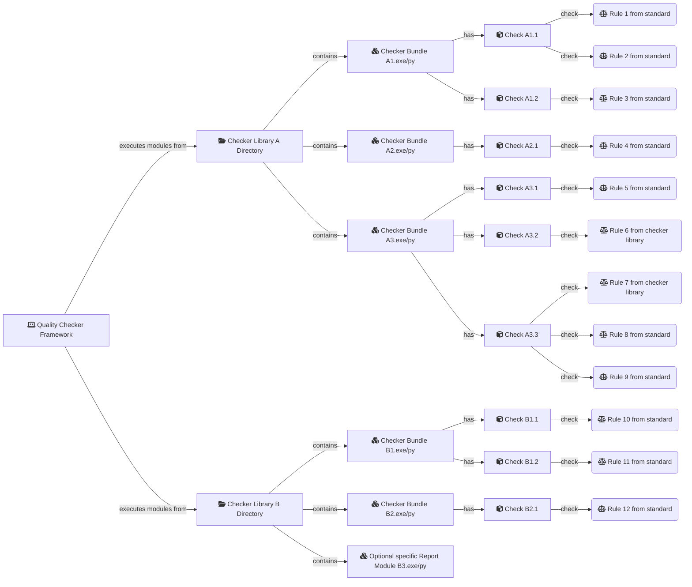
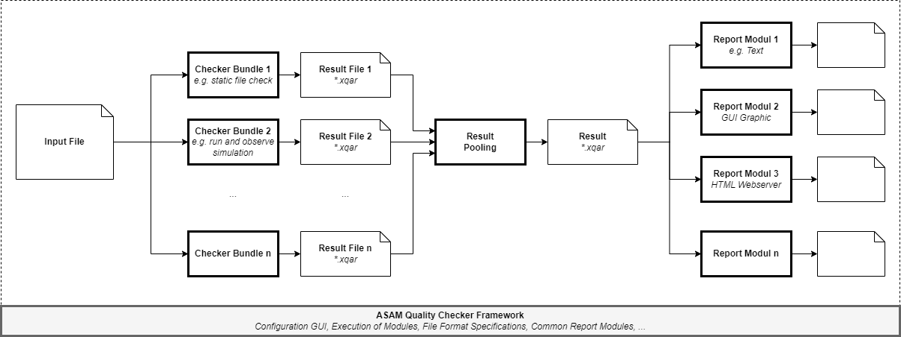

<!---
Copyright 2023 CARIAD SE.
 
This Source Code Form is subject to the terms of the Mozilla
Public License, v. 2.0. If a copy of the MPL was not distributed
with this file, You can obtain one at https://mozilla.org/MPL/2.0/.
-->

# Architecture

## High-level Requirements

The following requirement list was the foundation for the design of the
framework:

- Possibility to include a common ASAM rule set, which validates the rules from
  the specification document
- Write own rule sets, implemented in any programming language
- Extract meta information (e.g. if the file contain specific objects and the
  location of them)
- Configuration sets and parametrization of rules
- Possibility to include results based on the analysis of simulation runs
- Human and machine readable results
- Interactive usage or run in an automated workflow
- Locate the results in the XML source code and in a visualization of the map

## Terms / Definitions

- **Input File:** The file which should be checked by the Quality Checker Framework
- **Rule:** A textual description/definition about the input file
  characteristics.
- **Check/Checker:** A software module that tests rules compliance or creates
  statistical information about the input file. This can be a static or a
  dynamic test
- **Checker Bundle:** An executable or script that includes one or more
  Checkers. Checker Bundles allow checks to be better structured and divided
  into logical groups. In short they:
  - are a summary of several Checkers
    - with similar functions
    - from one supplier
    - developed in one distinct development environment/programming language
  - allow for files only be read/prepared once via parser
  - can be started via external scripting/automation
- **Result File:** Checker Bundles write their results in a XML based `*.xqar`
  file. See [File Formats Reference](file_formats.md#result-file-xqar) for
  details and examples
- **Report Module:** Output / Transmission / Visualization Results
- **Checker Library:** Collection of Checker Bundles and/or Report Modules for
  one domain

- **Quality Checker Framework**, that:
  - feeds the input file to the individual Checker Bundles
  - selects and configures the checker
  - summarizes the results (Result Pooling)
  - calls the report modules so that the user can view or further process the
    results
  - provides standard Checkers and standard report modules

### Relations between Terms / Definitions

## Workflow ASAM Quality Checker Framework

## Properties / Requirements

- ASAM Quality Checker Framework
  - Runs on Windows & Linux, Local & Server
  - Configuration via XML file
    - Selection of Checker Bundles
    - Selection of individual Checkers in the bundles and their optional
      parameters → also defines the order in the overall report
    - Configuration which Checkers output what level (Info/Issue) → leads to
      overall result "red" or "yellow"
    - Selection of Report Modules
- Checker
  - See [Checks](checker_library.md#checks) in the chapter about Checker
    Libraries
- Checker Bundle
  - Runs probably only on certain platforms, because a third party product
    is not available for all platforms
- Result Pooling
  - Summarizes all results (overview and detailed view possible)
  - Gives each incident a unique Id → assignment results in different report
    modules
  - If necessary sorts and lists all information first and appends warnings and
    errors. Within these results, information is sorted by a central
    configuration. There is also the possibility for summarizing and filtering.
- Report Module
  - Runs maybe only on certain platforms (e.g. Web server or local graphical
    application)

## Parameterization and Sequence Control

A Checker Bundle and the included Checkers can be parameterized. A distinction
must be made between

- Globale Parameter
  - InputFile --> File to be validated by the Checker Bundles
- Parameter for the whole Checker Bundle --> "Checker Bundle Parameter"
  - Parameter that is relevant for one Checker Bundle
  - Can be used by different Checkers in this Checker Bundle
- Parameter for single Checkers --> "Checker Parameter"
