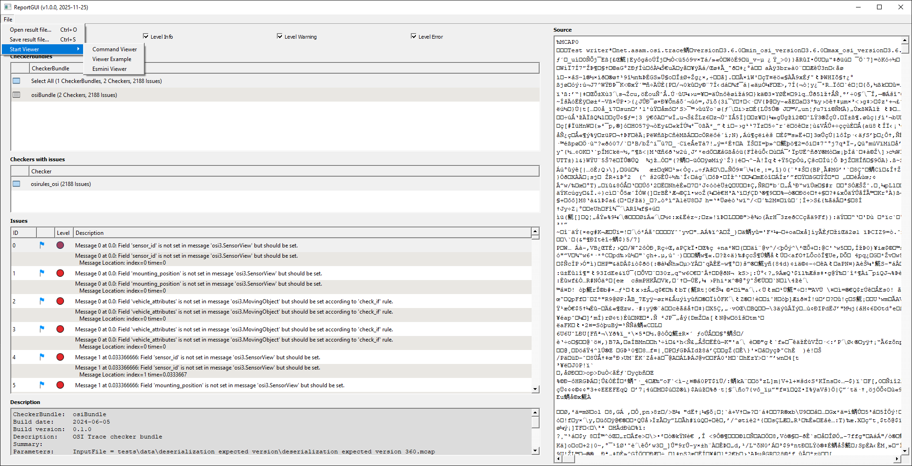
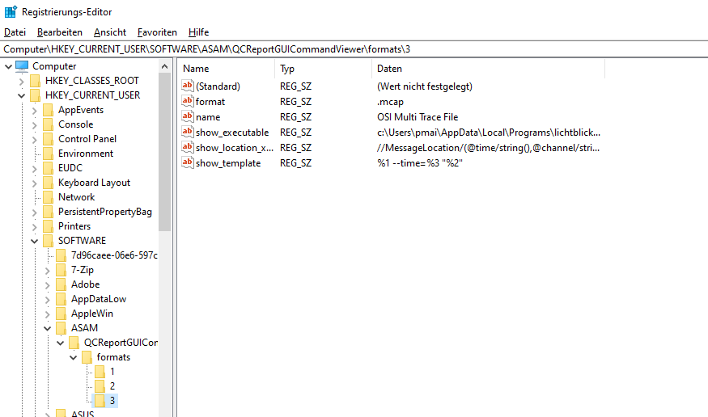
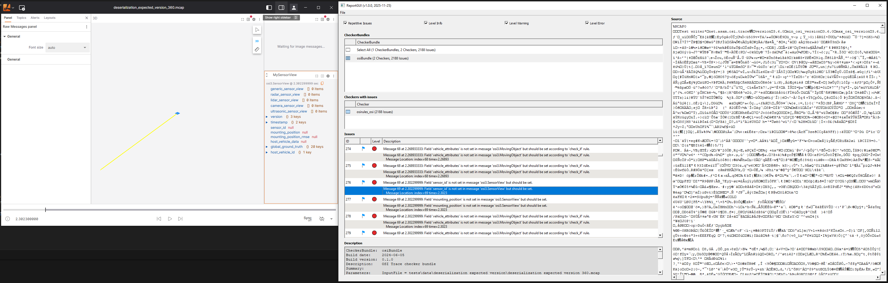

# Command viewer plugin

The command viewer plugin is a plugin to open the external applications based on the input file format and use calls to external commands to visualize an input file.
For each issue that contains supported location information (as matched via an XPath expression), the viewer will call an external command - passing information using a command template - to highlight the issue in the external viewer.

## Installation

After building the framework, a new plugin will be shown in the `File` dropdown menu of the ReportGUI application.

It is started automatically during startup and will support any configured formats (see below).
To restart the viewer plugin, the `File` dropdown menu of the ReportGUI application can be used.

Before using the plugin, relevant configuration needs to occur in the platform native way for Qt applications (see below).

## Configuration

The behavior of the command viewer plugin is controlled using the native Qt mechanisms for settings (`QSettings`).
This means that for Windows the settings are stored in the registry, for Linux in `conf` files, and for macOS in `plist` files.

The settings are user-settings under the `ASAM` organization and `QCReportGUICommandViewer` application name:

The main setting is the `formats` array, that will contain an entry for each file format to be supported by the command viewer.

Each entry in format contains the following set of keys:

- `format` (mandatory): The file extension (including any leading dot), that the input file shall have to be supported (example: `.osi`)
- `name` (mandatory): The format name as a user-readable string (example: `OSI Single Trace File`).
- `start_executable` (optional): A path to an executable that is to be executed once the viewer is started and initialized with an input file.
- `start_template` (optional): Template of the command line to execute once the viewer is started and initialized with an input file.
- `show_location_xpath` (optional): XPath to check for a showable location in an issue, and extract any necessary additional information for the `show_template`.
- `show_executable` (optional): A path to an executable that is to be executed once the viewer is instructed to show an issue and its location.
- `show_template` (optional): Template of the command line to execute when the viewer is instructed to show an issue and its location.
- `stop_executable` (optional): A path to an executable that is to be executed once the viewer is closing down.
- `stop_template` (optional): Template of the command line to execute once the viewer is closing down.

The way execution works for the individual steps follows the following rules:

If a `*_template` setting is found, then it is expanded into a full command-line using pattern substitution:

- Any occurrence of `%1` is replaced by the corresponding `*_executable` value.
- Any occurrence of `%2` is replaced by the input file path.
- For the `show_template`, any string result of the `show_location_xpath` is accessible with `%3` and so on.
- Double quotes can be used to guard against spaces for the splitting into command line arguments prior to execution.

Any executed commands are executed in parallel and should terminate on their own.
The plugin does not wait for termination, only for proper startup of the executed commands.

### Example Configuration for OSI and Lichtblick

As an example of the use of To support the visualization using Lichtblick of issues in OSI multi-channel trace files, as detected by the qc-osi-trace checker bundle, the following configuration is suitable:

- `format=.mcap`
- `name=OSI Multi Trace File`
- `show_location_xpath="//MessageLocation/(@time/string(),@channel/string())"`
- `show_executable=c:\\Users\\username\\AppData\\Local\\Programs\\lichtblick\\Lichtblick.exe`
- `show_template="%1 --time=%3 \"%2\""`

This means that for `.mcap` input files the command viewer will make all issues that have a `MessageLocation` location with `time` and `channel` attributes accessible.
It will execute the `Lichtblick` executable with the message time as its `--time` argument and the input file (`%2`) as a non-option argument.

If no current configuration for the command viewer plugin is detected on startup, a default configuration for Lichtblick is added, if Lichtblick can be found in its standards locations for Windows, Linux or mac OS.

