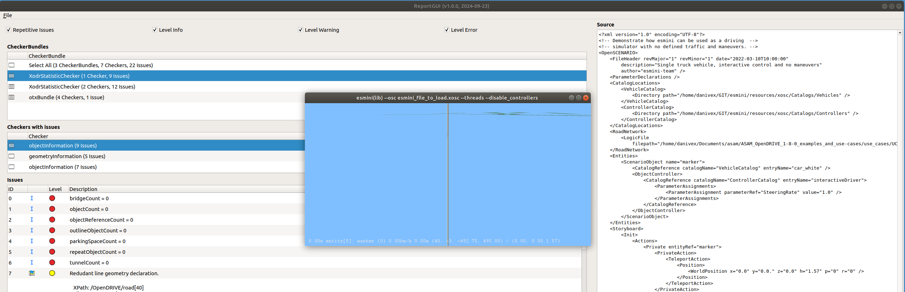
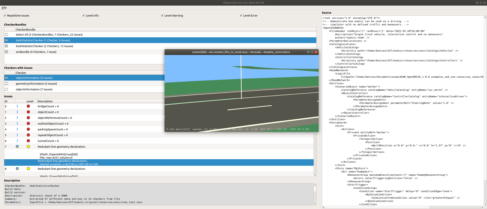

# Esmini viewer plugin


The esmini plugin is a plugin to open the [esmini simulator](https://esmini.github.io/) and visualize an input OpenDRIVE file. For each issue that contain the corresponding inertial positions, the viewer will highlight where the issue is located on the OpenDrive map.


The plugin depends on the esminiLib API. More information about the API can be found in the [official documentation](https://esmini.github.io/#_esmini_lib_programming).

## Installation

After building the framework, a new plugin will be shown in the `File` dropdown menu of the ReportGUI application. 


Before using the plugin, the esminiLib shared object file that is included in each [esmini release](https://github.com/esmini/esmini/releases) must be downloaded.

- If you are working on Windows, the library file is `esminiLib.dll`

- If you are working on Linux, the library file is `libesminiLib.so`

The library file must be downloaded to the user's local computer.

The application searches for the library file following this approach:

1. Check if the library file exists in the folder pointed to by the `ESMINI_LIB_PATH` environment variable.
2. Check if the library file is present in the folder where the `ReportGUI' executable is present.

So in order to use the plugin you can either:

- Define the `ESMINI_LIB_PATH` environment variable to where you downloaded the library file from esmini

    e.g.
    ```
    export ESMINI_LIB_PATH=/home/user/Downloads/esmini-demo/bin
    ```

- Or, copy the library file to the location where ReportGUI application is present

    e.g.
    ```
    cp /home/user/Downloads/esmini-demo/bin/libesminiLib.so ~/qc-build/bin/
    ```


## Remarks

When the Esmini Viewer is started, it initially points to the inertial location at the coordinate `x=0, y=0, z=0`. Your view may be empty if your map is not at `x=0, y=0, z=0`.



The view will update when you click on an issue that contains `Inertial Location`, as in the screenshot below. The new view will point to the corresponding location in the issue.

Note that not all issues contain a location. For example, issues related to XML Schema do not contain locations.




## Additional information

#### Camera control

See [esmini documentation](https://esmini.github.io/#_replayer) for a complete list of camera models and how to switch between different camera models.

For example, to navigate freely around the map, press 4 to switch to the Terrain camera model, and then hold down the middle mouse button to move around. Press 1 to return to the issue location.Press H for more help.

#### Which OpenDRIVE file to render

In order to establish which OpenDRIVE file to render in esmini, the plugin reads the `InputFile` param from the result file:

- If it is an OTX file, ignore it
- If it is an XODR file, wrap it in a simple and empty xosc file
- If it is an XOSC file, extract its XODR file and wrap it in a simple and empty xosc file

The template empty scenario file is created starting from [the string defined here](./xml_util.h#30)

#### esminiLib function

The plugin uses the following function from esminiLib:

- [`SE_Init`](https://github.com/esmini/esmini/blob/master/EnvironmentSimulator/Libraries/esminiLib/esminiLib.cpp#L645): used to initialize the player to visualize the right OpenDRIVE file
- [`SE_GetIdByName`](https://github.com/esmini/esmini/blob/master/EnvironmentSimulator/Libraries/esminiLib/esminiLib.cpp#L1424): to retrieve the `marker` object used to move the camera in the scenario
- [`SE_ReportObjectPosXYH`](https://github.com/esmini/esmini/blob/master/EnvironmentSimulator/Libraries/esminiLib/esminiLib.cpp#L1191): used to move the camera at specified location
- [`SE_Step`](https://github.com/esmini/esmini/blob/master/EnvironmentSimulator/Libraries/esminiLib/esminiLib.cpp#L955): used to allow the esmini player to advance
- [`SE_Close`](https://github.com/esmini/esmini/blob/master/EnvironmentSimulator/Libraries/esminiLib/esminiLib.cpp#L939): used to close the esmini player

The plugin was tested with [esmini 2.38.3](https://github.com/esmini/esmini/releases/tag/v2.38.3).