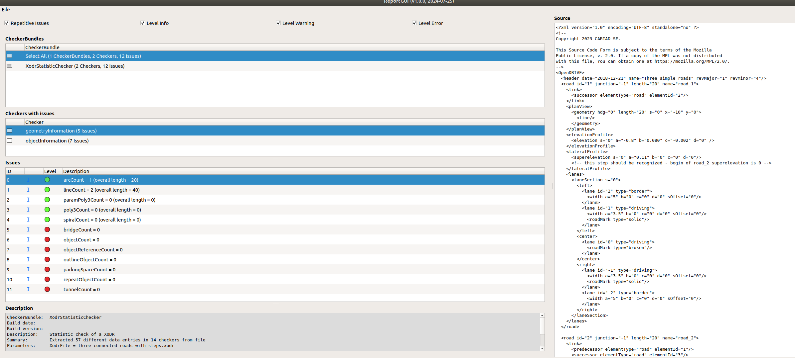
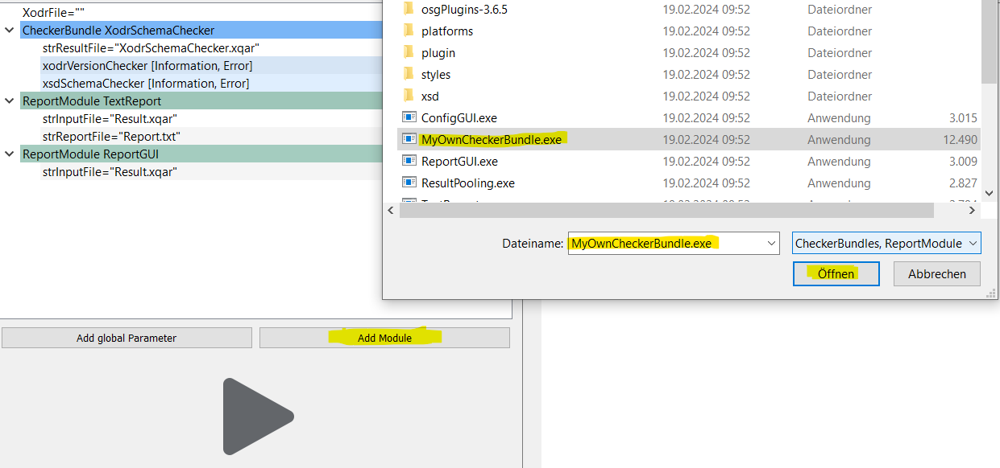

<!---
Copyright 2023 CARIAD SE.

This Source Code Form is subject to the terms of the Mozilla
Public License, v. 2.0. If a copy of the MPL was not distributed
with this file, You can obtain one at https://mozilla.org/MPL/2.0/.
-->

# Using the Checker Framework

## Configuration

### Introduction

The following documentation refers to the Windows installation. The QC4OpenX core is available for
other platforms as well. See [the Linux paragraph](#linux) for usage instructions under Linux.

For starting the configuration GUI and the framework just start

- `ConfigGUI.exe`

in the `bin` directory of your installation. Per default, `DefaultXodrConfiguration.xml` is loaded
by the application. You are free to replace this configuration by a different one. Depending on your
use case, you will find the following pre defined configurations:

- `DefaultXodrConfiguration.xml` which can be used to check OpenDRIVE
- `DefaultXoscConfiguration.xml` which can be used to check OpenSCENARIO

You can open a configuration, by simply dropping the XML on the executable.

From there the CheckerBundle and ReportModuls can be selected and their parameter can be set.
Special parameters are the global parameters

- `XodrFile`
- `XoscFile`

on the top of the configuration GUI. These parameters define the OpenDRIVE file and/or the
OpenSCENARIO file which should be checked. All global parameters are passed to all CheckerBundles.
When defining a XoscFile the XodrFile will be automatically retrieved, if an OpenDRIVE file
reference is defined in the scenario. Both parameters are stored as absolute file paths currently.

### Loading/Executing Configurations

The loaded configuration is shown on the left side of the GUI. The right side shows the output of
each executable in sequence.

To open an existing configuration, use the menu **File→Open** or start the ConfigGUI.exe with the
configuration as a command line argument.

The configuration can be started with the big arrow button. The first step in the execution is a
**CleanUp**, where the old temporary files are deleted. After that, all configured CheckerBundles
are executed as configured. The shown order in the configuration is also the order of it's
execution. As a final step before calling the report modules, the result pooling is called
automatically to store the checker results in one result file.

### Changing/Saving Configurations

The configuration can be modified in the GUI with the context menu. Just press the right mouse
button to add, remove or change the order of the modules. It's also possible to modify the
parameters of the CheckerBundles. Within the menu **File → Save** or **File → SaveAs** can be used
to write the configuration to a file. This is necessary before executing the CheckerBundles for the
first time.

If you want to create a configuration from scratch use the menu **File →New**.

Own CheckerBundles and the ReportModules have to follow the specification in
[CheckerBundle/ReportModule Meta Model](writing_user_defined_modules.md). If they use this mechanisms then
the framework is able to include their output in the toolchain.

### Export Log Files

To export the log from the right side of the GUI, you can use the menu entry **Console->Save** to
store the output in one file.

## Available Checker Bundles

- [SchemaChecker](schema_checker.md)

## Reporting

The reporting of issues can be done in a text file, in a GUI and/or graphically in the 3D model of
the road network. The foundation for this is a file in the XML base Checker Result Format (XQAR)
containing all issues. The file format specification can be found on the page [File
formats](file_formats.md).

The QC4OpenX framework contains the following report modules:

- TextReport - generating a human readable text file with all issues
- ReportGUI (Windows only)

### Using the ReportGUI

This GUI can be used to filter reported issues. Just click on a CheckerBundle entry to show all
issues from this CheckerBundle. The list of Checkers can be used to filter issues from one Checker
in one CheckerBundle. The window on the bottom left contains all the information about the selected
issue. The source code on the right side moves to the location in the file, if the issue contains a
valid FileLocation.

Additionally it is possible to link issues that correspond to a 3D error with a viewer application.
A 3D error is an error in the 3D model of the road network - it gets marked with a little icon in
the left part of the ReportGUI window. This viewer is not part of the Open Source distributution of
the QC4OpenX framework, but we provide a binding mechanism which let's you provide your own
implementation. Please refer to [the documentation](viewer_interface.md) for details.

## Add Self Implemented CheckerBundles and ReportModules

You can add your own CheckerBundles and ReportModules to the configuration. Just add the executables
with the graphical user interface. There are some templates which are provided with the current
version. You are free to choose another executable, just specify the name without the file
extension.

Requirements for your own CheckerBundle can be found in the [User defined
modules](writing_user_defined_modules.md) documentation.

## Automation and Deployment

There are several ways for automating the checking process

Open user interface and load the `DefaultConfiguration.xml`

    > ConfigGUI.exe

Open user interface and load a specified configuration

    > ConfigGUI.exe myConfiguration.xml

Open user interface, load the specified configuration and run the process without user input

    > ConfigGUI.exe myConfiguration.xml -autostart

Open the application with `myConfiguration.xml` and a given XODR, which is under test. Autostart
enables the automatic mode

    > ConfigGUI.exe -config myConfiguration.xml -xodr myTrack.xodr [-autostart]

Open the application with `myConfiguration.xml` and a given XOSC, which is under test. Autostart
enables the automatic mode

    > ConfigGUI.exe -config myConfiguration.xml -xosc myScenario.xosc -autostart

The easiest way is to adapt and use the two delivered batch scripts `CheckXodr.bat` and
`CheckXosc.bat`. They automate the complete process and execute all delivered CheckerBundles, create
a text based report and open the ReportGUI for filtering the results.

## Linux

You can use the shell scripts `CheckXodr.sh` and `CheckXosc.sh` in combination with a self-written
configuration file for execution and generation of a textual report.
